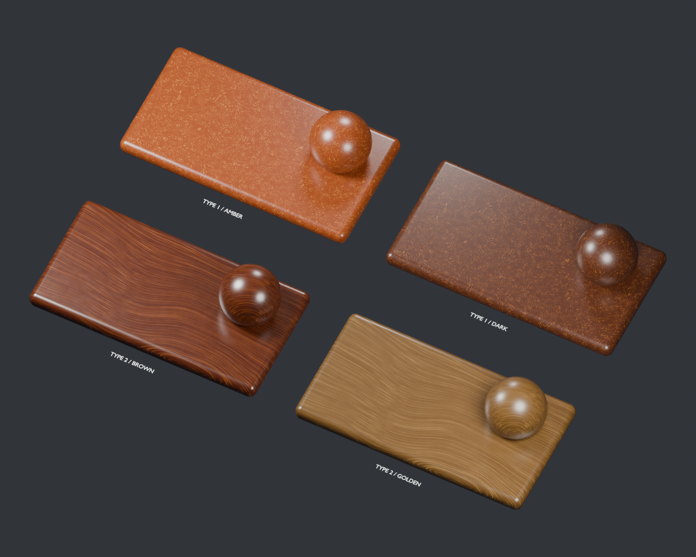

# Procedural Bakelite

Two separate material structures based on the supplied Type 1 and Type 2 photos.
Entirely native Blender 5.2 shader nodes: no image textures, UVs, OSL or add-ons.



## Materials

Append from `bakelite.blend` > Material, or open the blend and inspect the
**Bakelite Controls** node on each sample.

| Pattern | Materials | Appearance |
| --- | --- | --- |
| Type 1 ? fragments | Bakelite - Type 1 Amber; Bakelite - Type 1 Dark | Irregular packets of short amber filler streaks in dark resin |
| Type 2 ? flow | Bakelite - Type 2 Brown; Bakelite - Type 2 Golden | Fine elongated streaks following broad curved flow |

There are **two distinct pattern node groups**, with two color examples each.
No dropdown switches between the implementations. Both share one molded-resin
surface group from `shared/resin_finish.py`. Materials use fake users and ordinary
Append, without asset marking.

The four panels are 200 x 105 x 14 mm. Curved samples show how object-space
patterns wrap onto curved surfaces. Close-ups cover approximately 65 mm:

- [Type 1 detail](bakelite_type1_detail.png)
- [Type 2 detail](bakelite_type2_detail.png)
- [Eevee gallery](bakelite_eevee.png)

## Eight controls

| Control | Purpose |
| --- | --- |
| Resin Color | Dark background resin palette |
| Filler Color | Lighter embedded pattern color |
| Pattern Scale | Physical pattern size multiplier; 2 doubles all pattern features |
| Pattern Amount | Pattern visibility; 0 gives solid resin |
| Direction | Rotate the pattern around local axes |
| Seed | Change pattern placement |
| Roughness | Average surface roughness, with subtle procedural variation |
| Polish | Strength of the smooth resin-skin highlight; 0 removes the extra coat lobe |

Apply object scale with Ctrl+A > Scale. At scene Unit Scale 1, a 20 cm object
should measure 0.2 Blender units. Increasing object dimensions adds pattern
repeats rather than stretching a single pattern over the entire bounding box.

After appending into a scene with another Unit Scale, Tab into Bakelite Controls
and set **Advanced Bakelite Settings > Scene Unit m** to that Unit Scale. Displaying
lengths in centimeters alone does not require a change. Make the wrapper group
single-user before changing its internal settings for only one material.

Type 2 flows predominantly along local X and is designed for broad local XY
faces. Rotate Direction to match the object's long axis and broad face. It is a
3D field, with much less variation through local Z to keep the visible fibers
long. It does not infer a mold direction or follow an arbitrary curved object
centerline automatically.

## Implementation

Type 1 uses distorted Voronoi regions as filler packets. Each packet has a
random orientation of stretched, ragged noise strands, modulated by irregular
resin pools and fine filler specks. This creates short fragments and interrupted
streaks without introducing a repeating woven pattern.

Type 2 uses smooth domain distortion followed by two scales of strongly stretched
noise. Thresholds make thin, irregular strands with broad flow bends rather than
regular wave bands. This structure is independent of the Type 1 packet graph.

The patterns affect base color beneath a smooth nonmetallic resin surface.
The shared finish adds uneven roughness and a microscopic 0.003 mm mold texture;
the filler patterns do not become carved grooves. A modest Principled coat lobe
approximates a polished resin skin. This is an opaque appearance shader, not a
chemical composition or subsurface filler simulation.

No scratch image or other bitmap is loaded. The supplied photographs are stored in [references/](references/) and remain
reference-only and are not sampled by the material. This first version captures
the two pattern families; exact fragment silhouettes, stains, wear, stamps and
object-specific mold flow in the photos are not reproduced. An image mask remains
an option for a closer match if these procedural shapes need further refinement.

## Generate and test

From the repository root in PowerShell:

```powershell
$blender = 'C:/Program Files (x86)/Steam/steamapps/common/Blender/blender.exe'
& $blender --factory-startup -b --python-exit-code 1 -P bakelite/bakelite.py -- --preview --render
& $blender --factory-startup -b bakelite/bakelite.blend --python-exit-code 1 -P bakelite/test_material.py
```

Running bakelite.py with selected meshes assigns Type 1. Preview generation saves
the gallery, embeds the generator and shared resin source, and renders the gallery
plus two detail images. Tests render numeric Cycles samples and the Eevee gallery,
then write validation.json without overwriting the saved scene.

Validation covers separate pattern structures, shared finish identity, absence of
image texture nodes, varied masks, seed/scale/direction changes, hidden filler,
editable colors, roughness variation and equivalent physical scene units.

[Reference interpretation and implementation log](DESIGN_LOG.md).
