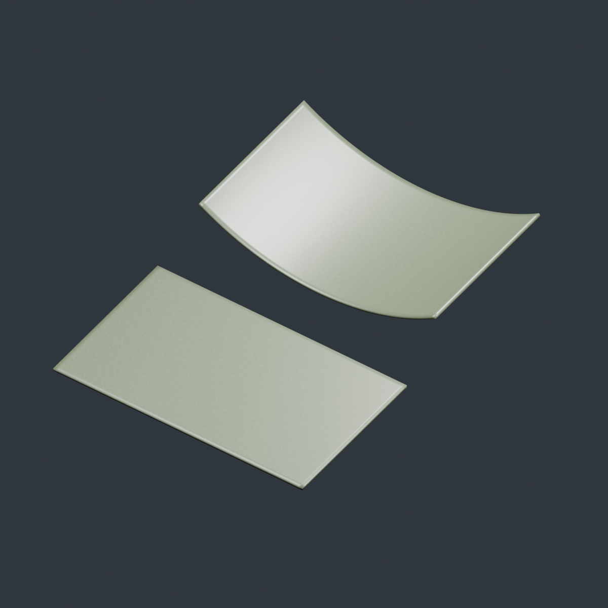

# Fiberglass reinforced plastic

A molded plastic surface containing randomly oriented short glass fibers.
This replaces the earlier woven-cloth material. The fibers are procedural; optional finish scratches use a shared packed image.
There are no woven bands or directional weave highlights.



[Short-fiber close-up](glassfiber_detail.png) ? [Eevee preview](glassfiber_eevee.png)

## Use

Open `glassfiber.blend` and append **Fiberglass Reinforced Plastic** or
**FRP - Satin Plastic**. The sample scene contains curved and flat 200 x 120 mm
panels. Alternatively run `glassfiber.py` with UV-unwrapped meshes selected.

The active render UV map controls surface placement. Set **UV Width mm** and
**UV Height mm** to the physical distances represented by the entire 0?1 UV span.
Maintain consistent UV scale across islands. Resize these values if the object's
physical dimensions change. UV distortion stretches the fibers.

## Controls

| Control | Effect |
| --- | --- |
| Plastic Color | Base molded-plastic tint |
| Fiber Color | Tint of visible embedded fibers |
| UV Width / Height mm | Physical UV domain size; default 200 x 120 mm |
| Fiber Length mm | Nominal maximum segment length; randomized from half to full length |
| Fiber Width mm | Apparent fiber diameter, including a soft edge |
| Fiber Density | Probability of a fiber per candidate cell; zero removes all fibers |
| Fiber Visibility | Contrast against plastic; zero hides fibers and their relief |
| Fiber Relief mm | Very shallow bump distance; zero keeps the surface smooth |
| Roughness | Plastic surface roughness |
| Coat Amount | Smooth glossy resin contribution from the shared finish module |
| Seed | Repositions and reorients fibers |
| Scene Unit m | Meters per Blender unit for bump-depth conversion |

Default fibers are 1.5?3 mm long, 0.045 mm wide, with only 0.004 mm bump distance.
These are artistic surface settings, not measured reinforcement specifications.
Fiber Density is not a physical volume or weight fraction. Increasing nominal
length also increases cell spacing, so fiber count per area decreases.

## Implementation

Three rotated and offset procedural cell layers each generate finite capsule
segments with randomized centers, angles, lengths, and occupancy. Their masks
combine into scattered short fibers. The mask blends fiber color into plastic
and slightly modifies roughness and relief. Fine noise adds a molded finish.
The Principled shader is nonmetallic and isotropic, with a smooth resin coat.

This is a surface approximation of opaque short-fiber reinforced plastic. It
models visible fiber traces, not actual interior strands, loose fuzz, fracture,
transmission, or mold-flow alignment. The fibers are straight segments; heavily
buried fibers can be represented by reducing visibility. No UVs means no reliable
pattern placement; seams and stretching should be handled in the mesh unwrap.

## Regenerate and test

From the project root:

```powershell
$blender = 'C:\Program Files (x86)\Steam\steamapps\common\Blender\blender.exe'
& $blender --factory-startup -b --python-exit-code 1 -P glassfiber/glassfiber.py -- --preview --render
& $blender --factory-startup -b glassfiber/glassfiber.blend --python-exit-code 1 -P glassfiber/test_material.py
```

The generator saves the scene with its embedded script and produces the Cycles
gallery and close-up. Tests render masks to check zero density, nonuniform fiber
coverage, changed seed, increased width, and zero visibility; they also check
that no weave tangent remains, render Eevee, and write `validation.json`.
Tests do not overwrite the saved gallery.

## Shared surface finish

FRP and wood both use `shared/surface_finish.py`. Clear Finish defaults to Clear
Paint (used here as the resin surface); None disables it and Wax is also available.
Coat Amount replaces the earlier Resin Coat control. Surface Scratches, Smudges,
and Surface Dust default to zero for FRP. Enable them to add imperfections above
its resin finish. Scratches use the packed image in `shared/textures/`; tile size
is in mm. Keep the shared folder for regeneration. Existing embedded node groups
need no Python files to render.
