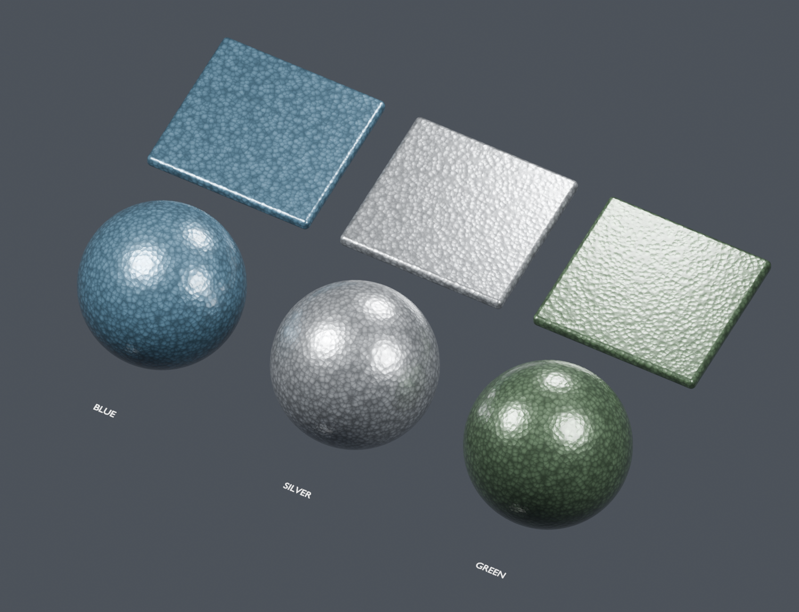

# Hammertone paint

Procedural metallic hammered paint for Blender 5.2, with blue, silver and green
presets sharing one shader structure. The saved gallery contains 100 mm panels
and 98 mm spheres. No UV map or image textures are required.

Open [hammertone.blend](hammertone.blend), or use **File > Append >
hammertone.blend > Material** and choose `Hammertone - Blue`, `Silver`, or `Green`.
The materials have fake users and are not marked as Blender assets.



## Controls

| Input | Purpose |
| --- | --- |
| Paint Color | Color of the metallic paint binder/pigment approximation. |
| Cell Size mm | Nominal procedural cell spacing; default 2.8 mm. Individual cells vary. |
| Hammer Amount | Cell color contrast and shallow bump together; 0 gives smooth, uniform paint color. |
| Roughness | Base paint reflection width; procedural variation follows Hammer Amount. |
| Metallic Sheen | Approximation of metallic pigment loading, not exposed substrate. |
| Gloss Coat | Dielectric reflection from the paint's clear binder. |
| Smudges | Shared surface patches increase paint and coat roughness. |
| Dust | Shared final shader deposits; 0 gives a clean surface. |

Use real object dimensions and **apply object scale** before assigning. The
generator captures the scene's Unit Scale and converts local object coordinates
to millimeters. Appending into a scene with a different Unit Scale requires
updating `Scene Unit m` inside `Advanced Paint Settings` or rebuilding with the
script in that scene. Object translation and rotation carry the pattern with it.
`Seed` is also available inside that advanced group.

At the default Hammer Amount, the nominal bump distance is 0.128 mm, with bump
strength 1. Fine paint texture adds a small secondary variation to the height.
This is a shading effect and does not alter the silhouette. Cell
spacing and relief are artistic defaults, not measurements of a specific paint.

## Structure and reuse

Noise slightly distorts 3D Voronoi cells. A rounded distance profile shapes shallow
basins and pigment gradients, while distance-to-edge softly darkens cell rims.
Per-cell variation breaks up the uniformity. Principled BSDF combines the
metallic pigment approximation with a dielectric coat, both following the same
relief. The stronger relief and fine surface texture follow the supplied
[reference photos](references/); the photos are visual guides, not texture maps.

`Shared - Surface Patch Field v1` supplies smudges and `Shared - Surface Deposits
v1` places optional dust over the final shader. These are the existing modules
used by the other materials. No new shared implementation or scratch texture is
needed for this finish.

Generator, shared surface module and GPU helper are embedded in the blend.
Running `hammertone.py` from Blender's Text Editor assigns the blue material to
selected meshes. Keep the repository layout for command-line regeneration.

```powershell
$blender = 'C:\Program Files (x86)\Steam\steamapps\common\Blender\blender.exe'
& $blender --factory-startup -b --python-exit-code 1 -P hammertone/hammertone.py -- --preview --render
& $blender --factory-startup -b hammertone/hammertone.blend --python-exit-code 1 -P hammertone/test_material.py
```

The gallery uses GPU Cycles where available. Validation uses small CPU Cycles
emission renders to check values and physical scaling, then renders Eevee without
overwriting the saved Cycles scene. See [validation.json](validation.json),
[close-up](hammertone_detail.png) and [Eevee gallery](hammertone_eevee.png).

The visual direction follows the subtle hammered texture and metallic sheen
described by [Hammerite](https://en.hammerite.com.cy/product/direct-to-rust-metal-paint-aerosol-hammered-finish/).
This is a visual approximation, not a paint chemistry simulation or brand color match.
