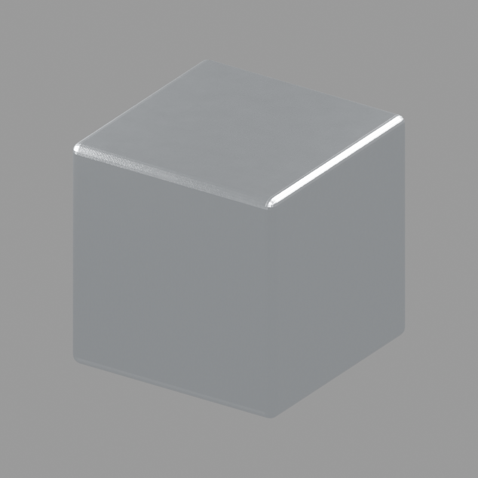

# Machined aluminum

Solid silver aluminum with parallel milling marks, anisotropic reflections,
and subtle uneven roughness. No paint, rust, dust, or random damage layers.

Open `machined_aluminum.blend`, or run `machined_aluminum.py` on a selected mesh.
The material is procedural and requires no UVs. Shared preview utilities live
one directory above this folder. See the [root guide](../README.md) for commands.

| Control | Effect |
| --- | --- |
| Aluminum Color | Metal reflection tint |
| Roughness | Base finish roughness |
| Roughness Variation | Subtle patches of roughness; zero gives uniform roughness |
| Anisotropy | Directional highlight strength |
| Tool Mark Scale | Groove density; higher values make finer lines |
| Tool Mark Depth | Shallow groove bump distance; zero removes relief |
| Machining Rotation | Local Z rotation in radians, including highlight direction |

The pattern uses object coordinates. Apply scale for consistent groove spacing.
This is a parallel milled finish, intended primarily for planar machined faces;
it does not model circular lathe tracks. Cycles is the reference preview engine;
Eevee can produce different directional reflections.
