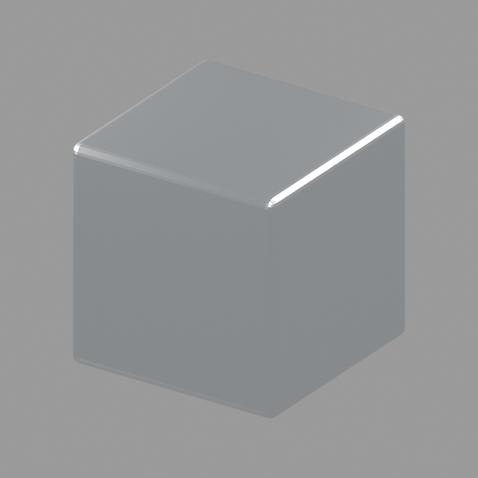

# Machined metal

Neutral silver metal with fine machining striations, directional reflections,
and image-driven roughness. Renamed from Machined Aluminum.

Open `machined_metal.blend`, or run `machined_metal.py` on a selected mesh.
The grayscale `textures/machining_height.png` supplies subtle base-color, anisotropy,
and roughness variation without bump or normal-map relief. It uses Non-Color data and is packed into the saved
scene; the external copy is included for editing and script regeneration.

| Control | Effect |
| --- | --- |
| Metal Color | Metal reflection tint |
| Roughness | Base finish roughness |
| Roughness Variation | Image-driven roughness strength; zero makes it uniform |
| Anisotropy | Directional highlight strength |
| Tool Mark Scale | Image repeats per object-space unit |
| Mark Color Variation | Subtle texture modulation of metal color; zero disables it |
| Anisotropy Variation | Texture modulation of highlight strength; zero disables it |
| Machining Rotation | Local Z rotation in radians |

Blended box projection avoids requiring UVs. Apply object scale for consistent
spacing. This approximates a parallel machined finish; box blends on corners
and a single highlight direction are not a per-face machining simulation.
Cycles and Eevee previews are supplied.

Keep the folder structure for running the generator. Shared studio utilities
live in the project root; see the [root guide](../README.md) for commands.
