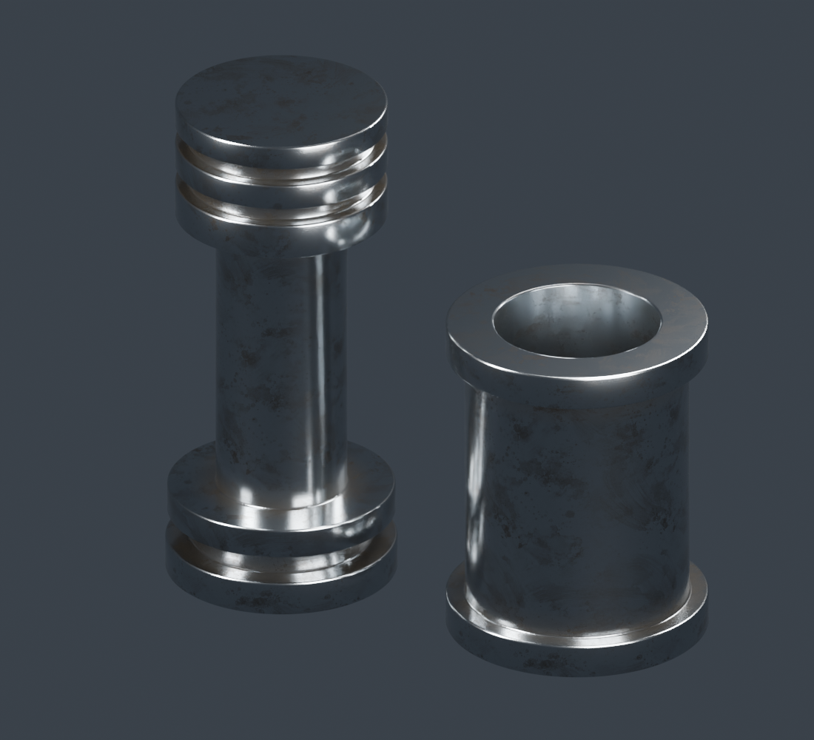

# Oily polished machinery steel

Polished/chromed-style steel with fine turning marks, irregular oil-wipe stains,
and dark grease accumulated in grooves and around collars. The separate preview
uses a stepped piston-style shaft and hollow cylinder sleeve.



Open `oily_polished_steel.blend`, or run `oily_polished_steel.py` in Blender 5.2's
Text Editor with meshes selected. The material group exposes:

| Control | Effect |
| --- | --- |
| Steel Color | Reflective base metal tint |
| Metal Roughness | 0.16 default; lower toward 0.05 for a chrome-like finish |
| Oil Tint / Oil Amount | Brown-gray smears over the metal; zero amount removes smears |
| Oil Scale | Image repeats per object-space unit |
| Oil Roughness | Roughness of the contaminated metal below the glossy coat |
| Grease Color / Crease Grease | Dark nonmetallic grease; zero amount removes accumulation |
| Grease Distance | AO radius for detecting sheltered creases, in scene units |
| Machining Depth / Scale | Fine turning-mark relief and frequency |
| Machining Rotation | Rotate local machining coordinates in radians; default axis is Z |

The single `textures/oil_smear_mask.png` image supplies irregular residue coverage.
It is Non-Color data with repeating blended box projection, packed into the blend.
No UV unwrap is required. Keep the textures folder beside the standalone script;
the embedded script can rebuild from the packed image without the external PNG.
Color, metallic response, machining marks, and AO crease detection remain nodes.
Oil uses a tinted metallic base and a dielectric coat; heavier grease is a separate
nonmetallic shader. This is an artistic approximation, not a measured lubricant
optical model. No rainbow film effect is added by default.

Cycles is the reference renderer. Eevee supports the node types, but its
screen-space AO can produce different grease accumulation. Real cavities are
needed for crease detection; shader bump alone cannot create AO creases.
Use consistent object scale. Default distances fit the roughly 2.7-unit shaft.
Fine turning lines wrap a Z-aligned shaft; rotate the machining coordinates for
other axis orientations. Large grooves and collars are preview geometry.

Regenerate the separate preview from this folder:

```powershell
& 'C:\Program Files\Blender Foundation\Blender 5.2\blender.exe' -b ../test.blend --python-exit-code 1 -P oily_polished_steel.py -- --preview --render
```

Outputs are saved here; the original `test.blend` stays unchanged. For clean
polished steel, set both Oil Amount and Crease Grease to zero.
