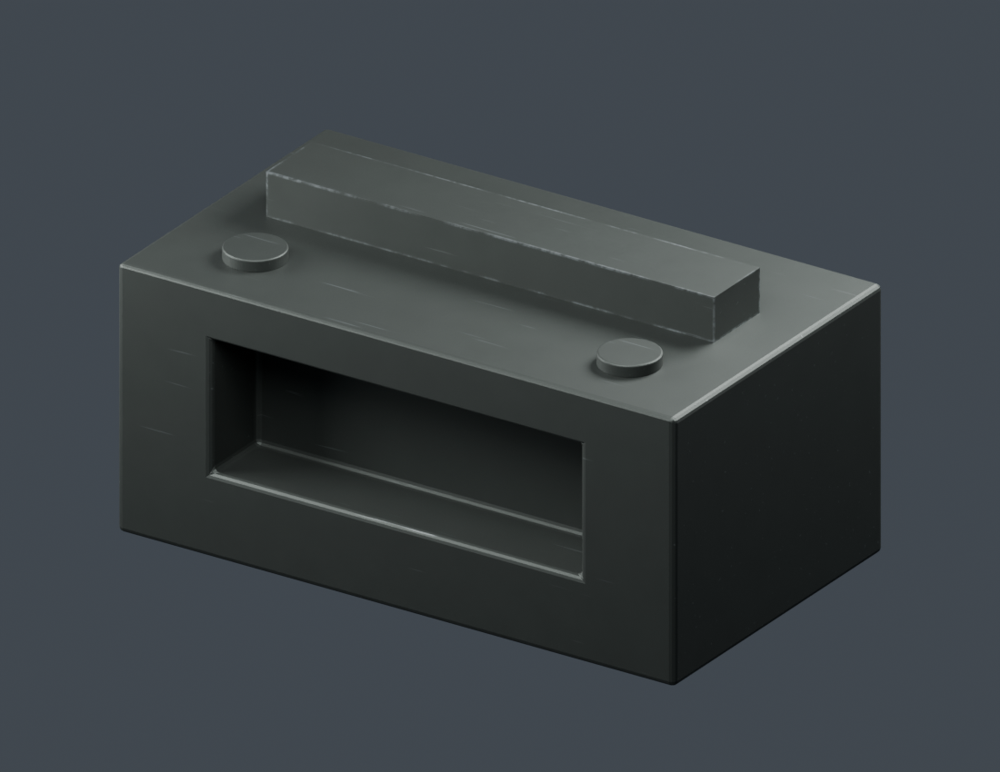
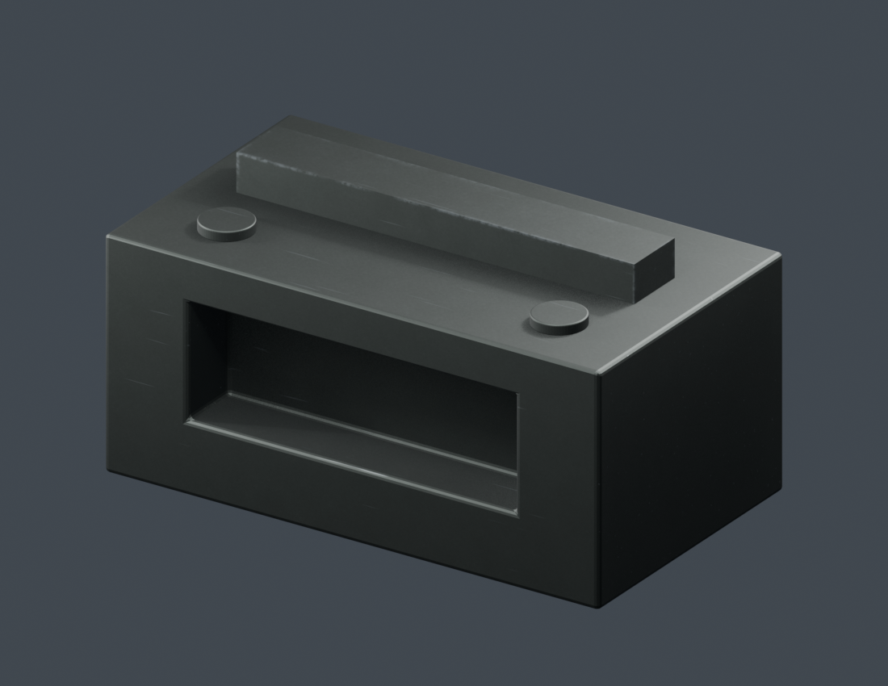

# Slightly used phosphated gun steel

Dark charcoal, subtly green-gray phosphate finish with microscopic grain,
uneven matte roughness, restrained edge polishing, and sparse shallow scratches.
This is an artistic approximation of phosphated/Parkerized steel, with no
paint flakes or heavy rust. Hybrid shader: a single grayscale image supplies
irregular phosphate microrelief and subtle roughness variation. Color, scratches,
edge wear, and overall finish remain procedural and adjustable.



Open `phosphated_gun_steel.py` in Blender 5.2's Text Editor, select your meshes,
and Run Script. It chooses the Cycles or Eevee material from the current scene's
render engine and installs the Eevee convex-edge tag modifier automatically.
Use `--eevee` from the command line to force that path. Adjust either
material group in the Shader Editor. The saved `.blend` includes both materials,
a machined sample with a pocket, raised rib and circular details, plus studio
lighting and an embedded copy of the script.

| Control | Purpose |
| --- | --- |
| Finish Color / Exposed Steel | Coated surface and polished steel colors |
| Roughness | Matte finish; defaults to 0.57 |
| Edge Wear | Restrained polish on sharp convex mesh edges; zero disables it |
| Edge Width | Width of eligible edge wear in meters; defaults to 0.0012 m |
| Scratches | Independent shallow abrasion; zero disables it |
| Grain Depth | Microscopic coating relief |
| Pattern Scale | Object-space texture frequency |
| Microdetail Tiling | Image repeats per object-space unit, multiplied by Pattern Scale |
| Micro Roughness | Strength of image-driven roughness variation; zero disables it |

`textures/phosphate_microdetail.png` is the only image texture. It is read as
**Non-Color**, repeated with blended box projection, and packed into the `.blend`.
No UV unwrap is required. Keep the textures folder next to the standalone script;
the supplied blend also works from its packed image when the external PNG is absent.
There are no separate color, metallic, scratch, edge-wear or normal-map images.
The image is an AI-generated artistic microdetail map, not a measured surface scan.
Generation prompt and provenance are recorded in `textures/SOURCE.md`.

Cycles is the reference renderer. `Phosphated Gun Steel - Slightly Used` uses
Cycles Pointiness; `Phosphated Gun Steel - Slightly Used - Eevee` reads the
`gun_steel_convex_sharp_edge` geometry attribute. The generator installs a
`Convex Edge Tags for Eevee` Geometry Nodes modifier when assigning the Eevee
material. When appending the Eevee material manually, run the generator in an
Eevee scene on the selected mesh so that modifier is installed. Keep that modifier
after bevel or subdivision; it evaluates the visible mesh. Use closed meshes,
outward normals and consistent object scale. The coating is a visual metallic
approximation, not a measured layered optical model.

From this folder, regenerate the preview (the source test scene is unchanged):

```powershell
& 'C:\Program Files (x86)\Steam\steamapps\common\Blender\blender.exe' --factory-startup -b --python-exit-code 1 -P phosphated_gun_steel.py -- --preview --render
& 'C:\Program Files (x86)\Steam\steamapps\common\Blender\blender.exe' --factory-startup -b phosphated_gun_steel.blend --python-exit-code 1 -P test_edge_wear.py
```

## Real dimensions

The shader now uses physical-size defaults. Apply object scale with **Ctrl+A >
Scale** before assigning the material, including after setting object dimensions.
Object coordinates use mesh-local dimensions; unapplied scale can stretch detail.
The material does not automatically normalize its texture to the object's bounds:
large parts show more repeats, while small parts retain the same feature size.

**Meters Per Unit** converts local coordinates into meters and converts bump/AO
lengths back into scene units. It defaults to Scene > Units > Unit Scale when the
material is generated. Leave it at **1** for ordinary meter-based Blender scenes,
even if the length display is centimeters. Use **0.01** only when Unit Scale is
0.01. After appending to a scene with different Unit Scale, update this input.
All depth and edge-width controls are entered in meters.

The saved steel sample is 0.28 m long. Pattern Scale defaults to 10;
Edge Width is 1.2 mm, Grain Depth is 0.01 mm, and Scratch Depth is 0.03 mm.
These are artistic shader settings, not measured coating specifications.

## Sharp edge wear

The older inverted AO mask marked smooth rounded edges. The Cycles shader
multiplies that narrow mask by a Pointiness threshold. The Eevee shader
multiplies it by a geometry attribute marking edges whose evaluated face-angle
exceeds 45 degrees in the convex direction. Smooth curves, broad bevels and
concave corners remain coated in both. Two procedural noise scales interrupt
eligible wear in centimeter and millimeter patches, leaving intact sections
along the same edge. Scratches remain independent.
The preview has a sharp raised rib and rounded body edges so both outcomes can be
compared. `test_edge_wear.py` renders a sharp box, smooth sphere, rounded box
and concave interior in both renderers and checks their masks numerically.
Pointiness depends on topology: very dense or heavily beveled meshes may need
a lower threshold inside `Sharp Edges Only`. The Eevee geometry tag updates
when the mesh/modifiers change, as long as its modifier remains installed.

The default Edge Wear is 0.65. Lower it for a cleaner part; the broken edge
pattern remains the same. A bevel applied in geometry may remove the sharp
topology that Pointiness reads. If a previously sharp edge should remain worn,
reduce its bevel or adjust the edge threshold in the geometry tag group.


