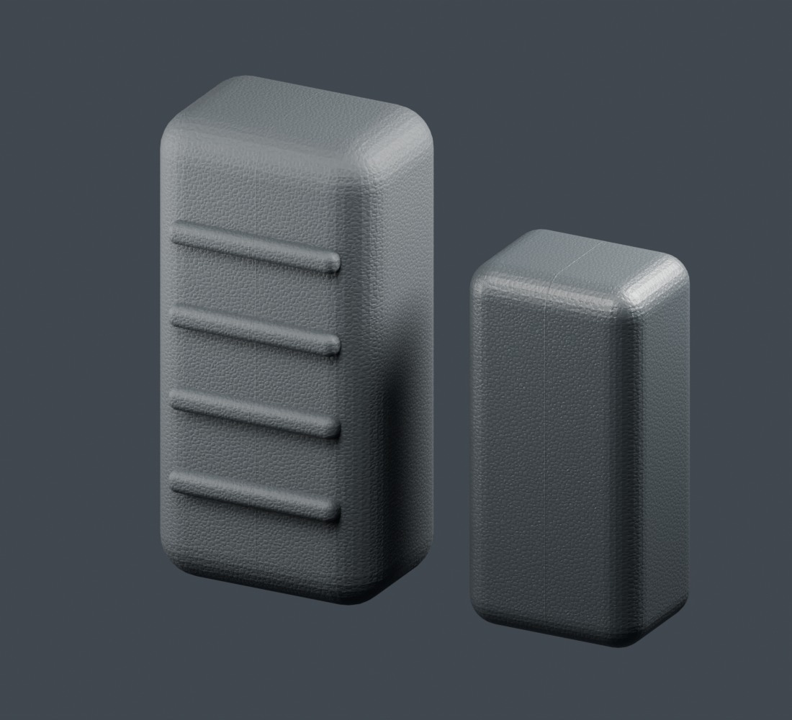

# Textured plastic / hard rubber grip

Hybrid nonmetallic molded stipple for stock surfaces and power-tool grips.
Includes charcoal **hard rubber** and slightly shinier **hard polymer** presets.
Rounded irregular pebbles, fine mold grain, and light handling polish on edges.



Open `textured_grip.blend` for both presets, or run `textured_grip.py` in Blender
5.2's Text Editor with meshes selected to assign the rubber preset. In the Python
API, `make_material(plastic=True)` builds the polymer preset. CLI supports `--plastic`.
The Shader Editor group exposes Base Color, Texture Scale, Texture Depth,
Micro Grain, Roughness, Handling Wear, Edge Width, and Texture Roughness.

## Optional mould parting line

Enable **Mould Line** for a narrow raised seam at the center of the grip. It is
off by default when generating a material and enabled on both preview samples.
The seam is procedural; it uses no extra image or UV map.

- **Mould Width:** full seam width, default 0.0008 m (0.8 mm).
- **Mould Height:** bump relief, default 0.0002 m (0.2 mm).
- **Mould Offset:** signed distance from the object's origin, in meters.
- **Mould Plane Normal:** parting-plane orientation in local object space.
  Default `(1, 0, 0)` gives the X=0 center plane: a vertical line down the front
  and back of an upright grip, continuing over rounded ends. Use `(0, 1, 0)`
  for a seam along the sides instead. Use a nonzero vector.

Center the object origin on the intended parting plane, or adjust Mould Offset.
Apply object scale to keep the physical width consistent. Separate pieces need
aligned local planes if the seam should continue across them. Texture Scale does
not affect seam width. Stipple is reduced on the seam to make it read as a mould
ridge. This is bump shading, so it does not add geometry or change the silhouette.

Higher Texture Scale produces smaller pebbles. Higher Texture Depth strengthens
the stipple. Set Handling Wear to zero for a fresh molding. Use Roughness around
0.45 for hard plastic or 0.65–0.75 for matte rubber. Both are visual presets:
they do not simulate physical softness.

The two presets share one grayscale image: `textures/molded_grip_height.png`.
It supplies irregular stipple height and subtle roughness modulation. Base color,
fine micro grain, and geometry-dependent handling wear remain procedural. There
are no separate color, metallic, wear, or normal-map images. Texture Roughness
controls the image-driven roughness variation; zero disables it.

The image uses Non-Color data, repeat wrapping, and blended box projection, and
is packed into the `.blend`. No UV unwrap is needed. Keep the textures folder
beside the standalone script; rebuilding from the packed preview also works
without the external PNG. This is AI-generated artistic height detail, not a
measured or calibrated scan; see `textures/SOURCE.md` for the generation prompt.

Object-space patterns suit consistently
scaled meshes; defaults fit the 20 cm tall grip sample. Relief is shader
bump, so it does not change the silhouette. Large ribs on the preview are geometry.
Cycles is the reference renderer; Eevee supports the node types but its
screen-space AO may give different handling-wear masks. Edge Width is entered in meters. Use solid meshes with outward normals for convex AO.

Regenerate the separate preview scene from this folder:

```powershell
& 'C:\Program Files\Blender Foundation\Blender 5.2\blender.exe' --factory-startup -b --python-exit-code 1 -P textured_grip.py -- --preview --render
```

The preview saves `textured_grip.blend` and `textured_grip_preview.png` here and
embeds the script in the blend file. The original test scene is unchanged.

## Real dimensions

The shader now uses physical-size defaults. Apply object scale with **Ctrl+A >
Scale** before assigning the material, including after setting object dimensions.
Object coordinates use mesh-local dimensions; unapplied scale can stretch detail.
The material does not automatically normalize its texture to the object's bounds:
large parts show more repeats, while small parts retain the same feature size.

**Meters Per Unit** converts local coordinates into meters and converts bump/AO
lengths back into scene units. It defaults to Scene > Units > Unit Scale when the
material is generated. Leave it at **1** for ordinary meter-based Blender scenes,
even if the length display is centimeters. Use **0.01** only when Unit Scale is
0.01. After appending to a scene with different Unit Scale, update this input.
All depth and edge-width controls are entered in meters.

The saved rubber grip is 0.20 m tall. Texture Scale defaults to 567;
Texture Depth is 0.5 mm for rubber and 0.3 mm for polymer. Micro Grain is
0.03 mm; the handling band is 1 mm. These are artistic shader settings,
not measured manufacturing specifications.
