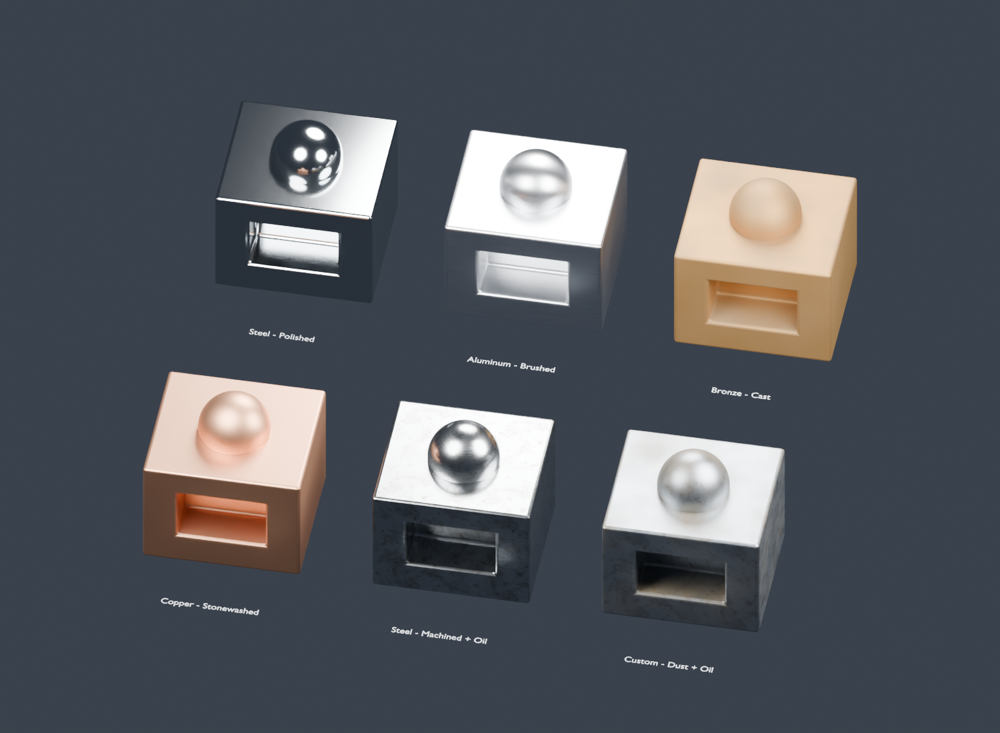

# Unified Metal v2

Separate manufacturing finishes with a shared base-metal palette and shared
surface imperfections. Native Blender 5.2 nodes; no add-on or UV unwrap required.



## Choose a material

Open `unified_metal.blend`, or use File > Append > Material to bring a material
into another scene. Each material has a **Metal Controls** node.

| Material | Structure | Everyday inputs |
| --- | --- | --- |
| UM Polished Metal | Smooth reflective finish with microscopic isotropic relief | 7 |
| UM Brushed Metal | Stretched directional grain and anisotropy | 9 |
| UM Cast Metal | Isotropic grain and shallow cast relief | 9 |
| UM Stonewashed Metal | Broader nonlinear dent pattern | 9 |
| UM Machined Metal | Turning bands in color, roughness and anisotropy; no groove bump | 10 |
| UM Custom Metal | Advanced isotropic authoring material with direct metal color | Full controls |

The former Finish dropdown is replaced by these materials. Each has a dedicated
finish group containing only its own pattern, rather than another wrapper around
the old all-finish switch. The ordinary materials retain **Base Metal** (Steel,
Aluminum, Bronze, Copper), because these choices share the same shader structure
and change only the palette. Use Color Tint to adjust the palette, or Custom Metal
for a directly editable metal color.

The saved gallery uses Steel/Polished, Aluminum/Brushed, Bronze/Cast with dust,
Copper/Stonewashed, Steel/Machined with oil, and Custom with dust and oil. These
are starting settings on the six materials, not six additional shader schemes.
Materials use fake users so unused materials remain saved; they are not marked
as Blender assets.

## Controls

| Control | Purpose |
| --- | --- |
| Base Metal | Metal palette; shared by all five everyday materials |
| Color Tint | Multiplies the chosen metal color; white preserves the palette |
| Roughness | Overall finish roughness before wear, oil and dust |
| Grain Scale | Pattern size multiplier, for textured finishes; 1 uses the 0.5 mm reference coordinate scale |
| Direction | Grain-coordinate rotation for Brushed and Machined |
| Surface Detail | Cast/Stonewashed detail strength, or Machined color/roughness/anisotropy variation |
| Edge Wear | Convex-edge polishing amount; 0 disables it |
| Surface Wear | Combined image scratches and handling smudges; 0 disables both |
| Dust | Surface and cavity dust amount; 0 disables it |
| Oil | Image-based oily film/stain amount; 0 disables it |

Polished omits Grain Scale, Direction and Surface Detail. Brushed omits Surface
Detail. Cast and Stonewashed omit Direction. Replaced the old size/wear dropdowns
and separate enable toggles with direct controls. All four imperfection amounts
are independent: set Edge Wear, Surface Wear, Dust and Oil to 0 for a clean finish.

## Shared surface imperfections

All six materials reference one **UM v2 | Metal Imperfections** group. It uses
**Shared - Surface Marks v1** for image scratches and handling smudges, plus
**Shared - Deposit Coverage v1** for surface dust. Wood and fiberglass reinforced
plastic use these same fields.

Metal consumes the shared **masks**, applying scratches to bare-metal roughness
and shallow bump, and smudges to roughness. It does not attach the wood clear coat.
Surface Wear drives scratch strength and smudge strength together, using the same
1:1.2 ratio as the simplified wood controls, clamped at 1.

Metal-specific effects remain in one common adapter: geometric convex-edge polish,
additional cavity dust, and an oil-smear image controlling color, roughness and a
Principled lubricant coat. **Shared - Surface Deposits v1** receives the final metal shader and adds
nonmetallic dust using that combined coverage.
The order remains finish > edge polish/scratches/smudges > oil > dust. None of
these effects removes plating or exposes another substrate.

Two Non-Color images are packed in the blend:

- `../shared/textures/clear_finish_scratches.png`: shared scratch mask; blended box projection.
- `textures/oil_smear_mask.png`: existing oil-smear mask; blended box projection.

No new images are required. Grain, edge polish, smudges and dust are node-based.
See [scratch source](../shared/textures/SOURCE.md) and [oil source](textures/SOURCE.md).
The shared Python implementation and generator are embedded for regeneration;
appended materials render without running Python or locating external images.

## Physical scale and orientation

Apply object scale with Ctrl+A > Scale. Object coordinates are converted to
millimeters, so a 20 cm object has appropriately small finish patterns when its
actual dimensions are 20 cm. The gallery blocks are 48 x 44 x 36 mm.

Grain Scale changes only manufacturing texture coordinates. Scratch repeat size,
edge-wear width, oil patches and dust spread remain in physical millimeters.
The reference Grain mm is a noise-coordinate size, not a measured groove period.

Brushed grain runs along local X. Machined bands follow local Z levels with a
circumferential tangent around local Z, rotated by Direction. Tangents use the
inverse coordinate rotation, object-to-world conversion and surface projection.
Stable fallbacks cover the turning axis and directions perpendicular to a face.
These are simplified turning marks, not arbitrary milling paths or radial face
machining. Machining marks have no height even at high Surface Detail; independent
scratches can still add shallow bump.

After appending into a scene with a different Unit Scale, Tab into Metal Controls
and set **Advanced Metal Settings > Scene Unit m** to that scale. A meter-based
scene uses 1, even if its display unit is centimeters. This internal setting is
shared by all users of that wrapper. Custom Metal exposes it directly.

## Advanced editing and limitations

Tab into an everyday group to adjust hidden finish tuning, seed, anisotropy,
scratch tile/depth, wear width, dust spread/color and oil patch/tint. Make that
wrapper single-user first for material-specific overrides; copying only a material
still shares its node groups. Changing a shared structure or imperfection group
affects all its users. Custom Metal exposes authoring controls directly and uses
an isotropic grain structure; there is no inactive Custom mode on everyday menus.

Diagnostic outputs are inside the material core instead of a public View dropdown.
Connect Roughness or the named mask outputs to emission when debugging.

Colors and finish values are artistic presets, not measured alloy spectra. Relief
uses bump shading. AO-based edge wear and cavity dust depend on real geometry and
neighboring surfaces; Cycles and Eevee can differ. Rust, coating removal, geometric
damage and measured reflectance are outside this implementation.

## Regenerate and test

From the repository root in PowerShell:

```powershell
$blender = 'C:/Program Files (x86)/Steam/steamapps/common/Blender/blender.exe'
& $blender --factory-startup -b --python-exit-code 1 -P unified_metal/unified_metal.py -- --preview --render
& $blender --factory-startup -b unified_metal/unified_metal.blend --python-exit-code 1 -P unified_metal/test_material.py -- --render-eevee
```

Run unified_metal.py in Blender's Text Editor with selected meshes to assign
Polished Metal. Keep the shared folder beside material folders to regenerate
from disk. Preview generation saves the blend, generator, packed textures and
Cycles gallery; testing writes validation.json and the Eevee gallery without
changing the saved scene.

Tests check separate finish implementations, small interfaces, shared module
identity, metal palettes, finish roughness, zero machining height, machining color
and anisotropy, rotated world-space tangents, disabled/enabled imperfections, exact
shared scratch-mask agreement, public tint/detail controls and physical scale.

[Design and implementation log](DESIGN_LOG.md).
