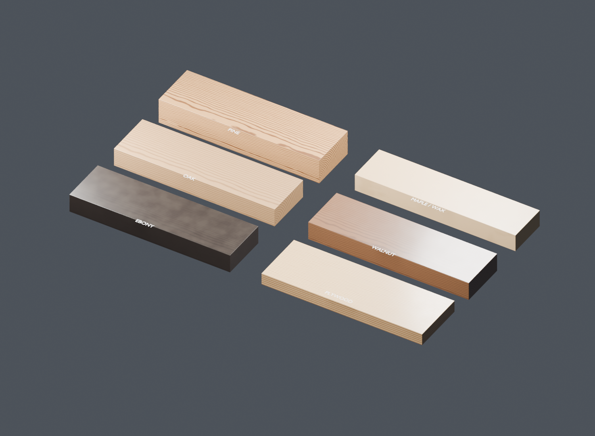

# Wood and plywood

Native Blender 5.2 shader nodes with procedural grain and a packed scratch image.
No UVs, OSL, or add-ons required.



## Choose a material

Append a material from `wood.blend` using File > Append > Material:

| Material | Appearance |
| --- | --- |
| Pine Wood | Strong growth-ring contrast, clear paint |
| Maple Wood | Pale, subtle straight grain, wax |
| Oak Wood | Prominent earlywood pores and subtle ray flecks, clear paint |
| Walnut Wood | Brown palette and intermediate pore detail, clear paint |
| Ebony Wood | Dark palette and fine pores, clear paint |
| Plywood Face | Light straight-grain outer veneer, clear paint |
| Plywood Edge | Even layers, alternating grain and thin glue lines, clear paint |
| Custom Wood | Full authoring controls for creating another appearance |

Materials are ordinary appendable datablocks, with fake users to retain unused
materials. All seven everyday materials reuse one **Wood - Physical Structure**
group, which uses the same shared finish module as fiberglass reinforced plastic.
Custom Wood exposes that master directly.

The gallery contains 240 mm boards and an 18 mm plywood panel. Pine/Maple are in
the back row, Oak/Walnut in the middle, and Ebony/Plywood in front.

## Everyday controls

Select the material's **Wood Controls** node in the Shader Editor.

| Control | Effect |
| --- | --- |
| Color Tint | Multiplies the wood palette; white preserves the original look |
| Grain Scale | Pattern size multiplier: 1 uses the preset's physical dimensions; 2 doubles grain size |
| Grain Direction | Euler rotation around local axes; grain initially follows local X |
| Grain Detail | Combines fine fiber color, pores, ray flecks, roughness variation and bump; 0 removes fine detail, 1 preserves the preset |
| Finish | None (raw wood), Clear Paint, or Wax |
| Surface Wear | Combines image scratches and handling smudges; 0 gives a clean finish |
| Dust | Independent dust amount; 0 removes deposits |

**Plywood Edge** additionally exposes **Ply Thickness mm** (default 1.5 mm).
Grain Scale changes the wood pattern, including pores, without changing physical
ply thickness, scratch size, smudge size or bump distance. Grain Detail controls
fine detail independently of the main growth-ring color contrast.

Finish None removes the coat and its visible scratches/smudges; dust remains
independent. Set Dust to zero for bare clean wood. Color Tint affects the wood,
including plywood edge tones, while the clear coat and dust retain their colors.

## Physical scale and plywood placement

Apply object scale with **Ctrl+A > Scale**. Coordinates use physical millimeters,
so a larger object contains more grain repeats at Grain Scale 1. A 20 cm object
should be 0.2 Blender units when Scene Unit Scale is 1; changing the display unit
to centimeters does not require any material adjustment.

The internal **Scene Unit m** value is captured when the group is generated.
After appending into a scene with a different Unit Scale, Tab into Wood Controls
and set **Advanced Wood Settings > Scene Unit m** to that scene's Unit Scale.
This setting belongs to the species wrapper and affects materials sharing it.
For Custom Wood it is directly exposed. Ordinary meter-based scenes use 1.

Plywood layers always follow local Z independently of Grain Direction. Put the
lower panel face at local Z=0 to align full plies with the panel boundary. Assign
Plywood Face to top/bottom polygons and Plywood Edge to cut edges, as in the
supplied panel. There is no automatic face classification.

## Advanced authoring

Use **Custom Wood** for individual ring spacing, warp size/amplitude, ring center,
seed, light/dark colors, roughness, fiber relief, vessel size/frequency/distribution,
ray flecks, plywood glue width, and individual finish controls. Its Wood Preset
starts at Custom. Named presets override appearance values without overwriting
stored Custom values; return to Custom to edit those values and see their effect.
Color Tint, Grain Scale and Grain Detail work with either mode.

The simplified materials fix low-impact tuning internally instead of exposing
controls overridden by the species preset. Surface Wear drives scratch strength
and smudge strength together (smudges = min(1, wear * 1.2)). Defaults preserve the
previous gallery's balance: wear 0.15 and dust 0.03. Scratch tile size, scratch
relief, coating roughness and dust color remain advanced settings.

To create another reusable species, add its values to WOOD_PRESETS in `wood.py`
and generate its wrapper with build_simple_group. Keep structure and finish
implementation in the shared groups. If manually editing a wrapper for a unique
material, make the wrapper node group single-user first; copying just the material
still shares the wrapper. Editing the master affects all its users.

## Surface finish and limitations

Clear paint and wax use the Principled coat with a separate normal. Image scratches
alter coat roughness and shallow coat bump; procedural smudges alter coat roughness.
A separate dust shader sits above the finished wood. The shared Non-Color scratch
mask uses blended box projection and is packed into the blend file. Its source is
`shared/textures/clear_finish_scratches.png`; wood grain itself needs no image map.

These are artistic species-inspired appearances, not measured density or botanical
models. Vessel pores use stretched 3D Voronoi fields, with simplified ray flecks.
Large knots and accurate cut-dependent ray anatomy are not modeled. Relief is
bump only; coating is an optical approximation rather than a transparent mesh.

## Generate and validate

Run from the material repository root in PowerShell:

```powershell
$blender = 'C:/Program Files (x86)/Steam/steamapps/common/Blender/blender.exe'
& $blender --factory-startup -b --python-exit-code 1 -P wood/wood.py -- --preview --render
& $blender --factory-startup -b wood/wood.blend --python-exit-code 1 -P wood/test_material.py
```

Running wood.py in Blender's Text Editor with selected meshes assigns Pine Wood.
Preview generation saves the gallery and embeds the generator and shared finish
source. Keep the shared folder beside material folders to regenerate from disk;
appended materials render without Python or external image files.

Tests verify the small interfaces, shared master, all species palettes/finishes,
public control responses, physical scale, ply/glue spacing, Custom preservation,
and the packed scratch texture. They render numeric Cycles EXRs and an Eevee
gallery, then write validation.json without changing the saved gallery.

[Plan and implementation log](DESIGN_LOG.md).

## Shared imperfection module update

Scratches and smudges now come from **Shared - Surface Marks v1** and feed the
material's **Clear Finish Response v3** before the BSDF. **Shared - Surface
Deposits v1** accepts the finished shader and applies dust afterward. Both stages
reuse the same procedural patch field, also used by unified metal and Bakelite.
Existing controls and defaults are preserved. See [shared module wiring](../shared/README.md).
