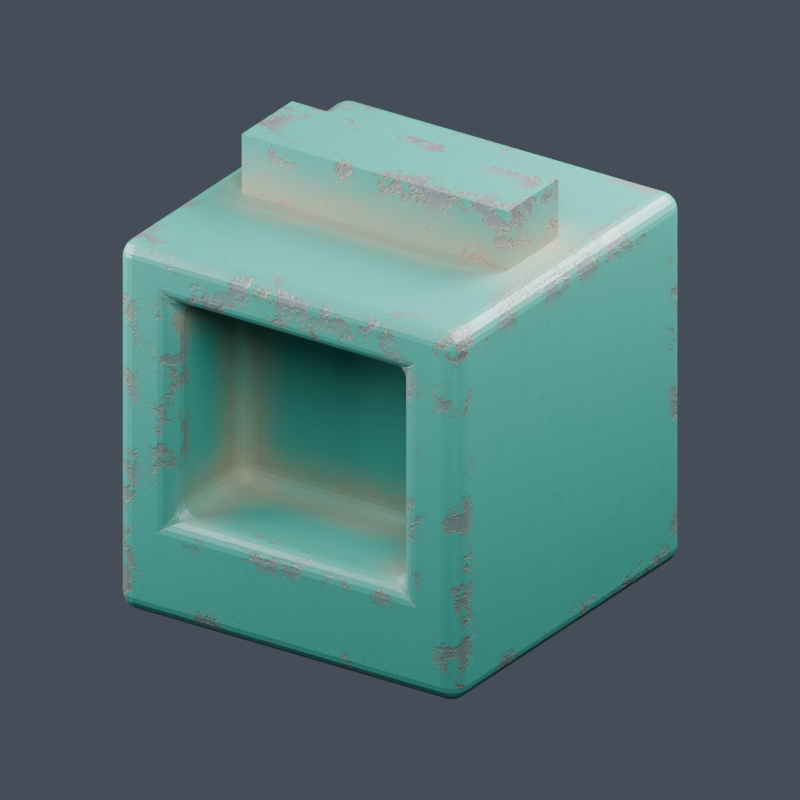

# Worn painted metal

Procedural shader-node material for Blender 5.2 with chipped paint, exposed
steel only at convex edges, accumulated dust, and uneven paint roughness.



In Blender 5.2, select your mesh, open `worn_painted_metal.py` in the Text Editor,
and Run Script. Adjust the material's group inputs in the Shader Editor.
No image textures or UV unwrap are required. Running normally only assigns the
material; the preview option also adjusts geometry modifiers, lights and camera.

Both Cycles and Eevee can render this material. Cycles is recommended for the
geometry-dependent effects. Eevee AO is approximate and view-dependent; it may
miss hidden geometry. The shader avoids the Cycles-only Bevel and Pointiness
features. See Blender's [AO node documentation](https://docs.blender.org/manual/en/latest/render/shader_nodes/input/ao.html).

| Control | Effect |
| --- | --- |
| Wear | Paint chip coverage within the edge wear band |
| Edge Wear | Edge paint loss and rust borders; zero disables both |
| Edge Width | Inside AO search distance, controlling the edge wear band |
| Dust Amount | Matte, nonmetallic dust in sheltered creases; zero disables it |
| Dust Distance | Outside AO search distance, controlling accumulation spread |
| Dust Color | Accumulated dust tint |
| Pattern Scale | Object-space chip, roughness and grain frequency |
| Paint Roughness | Base paint roughness |
| Roughness Variation | Uneven paint roughness strength; zero makes it uniform |
| Relief | Recessed paint chip bump depth |

Edge Width and Dust Distance are scene-space distances, independent of Pattern
Scale. Defaults suit a roughly two-unit object. Use consistent/applied object
scale, outward normals and solid geometry for inside AO. Very thin walls and
nearby surfaces can also affect AO: these are proximity masks, not exact edge
angle classification. Dust needs real concave geometry or contact surfaces;
shader bump alone cannot create AO creases. The preview bevel is optional.
The preview also includes a solid rail on top with unbeveled 90-degree edges,
so sharp-edge wear can be compared with the rounded cube edges. Paint chips
and rust borders are multiplied by the convex edge mask. Paint roughness
uses separate noise, and there are no scratch nodes or controls.

Run the following commands from this material folder. Shared preview utilities
and the base scene live in the project root.

To regenerate the simple cube preview:

```powershell
& 'C:\Program Files (x86)\Steam\steamapps\common\Blender\blender.exe' -b ../test.blend --python-exit-code 1 -P worn_painted_metal.py -- --preview --render
```

To test a recessed cube with both renderers and an effects-disabled comparison:

```powershell
& 'C:\Program Files (x86)\Steam\steamapps\common\Blender\blender.exe' -b worn_painted_metal.blend --python-exit-code 1 -P test_material.py
```

The test writes `recessed_metal_cycles.png`, `recessed_metal_eevee.png`, and
`recessed_metal_clean.png`, and saves the recessed sample as
`worn_painted_metal.blend`. It leaves `test.blend` untouched.
